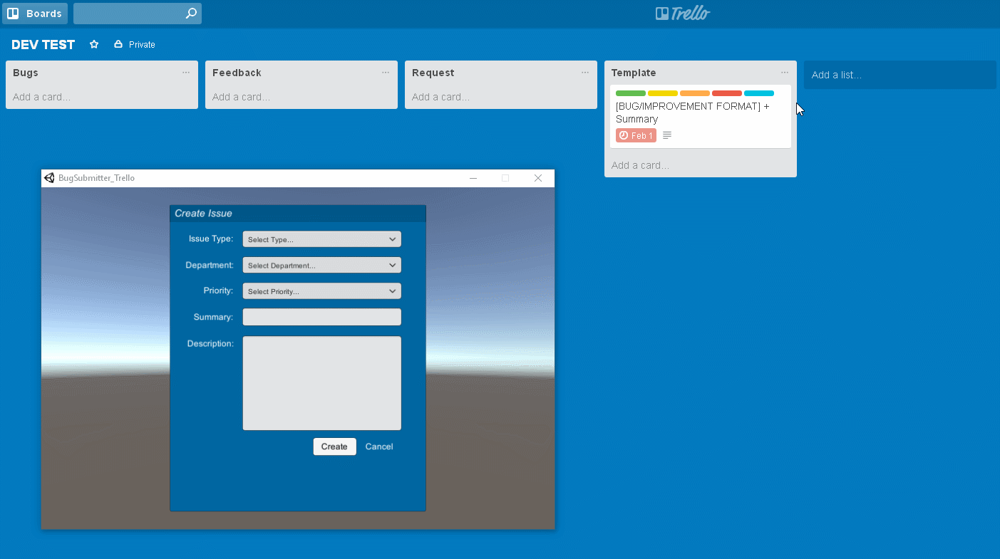

# UniTrello #

`Version 1.0`

UniTrello is a simplified user interface between Unity and Trello, designed to create a cost-effective solution for managing issues and exception handling in real-time.

UniTrello uses [LitJSON](https://lbv.github.io/litjson/) under a public domain license.

## API Documentation ##

### Trello.Trello

`public string key, token;`

Instantiate a Trello link with an assigned key and token.

#### Example

```C#
public Trello trello = new Trello (key, token);
```

### Trello.checkWwwStatus ###

`public string errorMessage, public WWW www;`

Check and compare an issue type from a given IssueType.

#### Example

```C#
WWW www = new WWW(string url, WWWform form);
 while(!www.isDone){
     checkWwwStatus("Could not process Trello card.", www);
}
```

### Trello.populateBoards ###

`public JSONData boardData;`

Download a list of available boards for a user.

#### Example

```C#
//Async
public IEnumerator getBoards() {
     yield return populateBoards();
}
```

### Trello.setCurrentBoard ### 

`public string name;`

Set the current board.

#### Example

```C#
string boardName = "Dev Hub";
if(boardName != ""){
     setCurrentBoard(boardName);
}
```

### Trello.populateLists ###

`public JSONData listData;`

Download available lists for the current board.

#### Example

```C#
//Async
public IEnumerator getLists() {
     yield return populateLists();
}
```

### Trello.setCurrentList ###

`public string name;`

Set the current list.

#### Example

```C#
//Async
public IEnumerator getLists() {
     string listName = "Bugs";
     yield return populateLists();
     if(listName != ""){
          setCurrentList(listName);
     }
}
```

### Trello.populateCards ###

`public JSONData cardData;`

Download a list of cards from the current list.

#### Example

```C#
//Async
public IEnumerator getCards() {
     yield return populateCards();
}
```

### Trello.setCurrentCard ###

`public string name;`

Set the last card created from a current access list.

#### Example

```C#
//Async
public IEnumerator getSetCards() {
     yield return populateCards();
     setCurrentCard();
}
```

### TrelloCard ###

`public TrelloCard;`

Create a new Trello card object. This accepts the following options:

* `string.pos`
* `string.name`
* `string.desc`
* `string.due`
* `string.idList`
* `string.idLabels`
* `string.urlSource`
* `string.fileSource`

#### Example

```C#
TrelloCard card = new TrelloCard();
card.pos = "top";
card.name = "My Trello Card";
card.urlSource = "null";
card.idList = currentListId;
card.fileSource = "MyFileUrl.png";
```

### Trello.newCard ###

`public TrelloCard card;`

Create a new Trello card object with a populated list ID.

#### Example

```C#
Trello trello = new Trello(key, token);
var card = trello.newCard();
```

### Trello.uploadCard ###

`public TrelloCard card;`

Uploads a given TrelloCard object to the Trello servers.

#### Example

```C#
Trello trello = new Trello(key, token);
                    
//Async
public IEnumerator UploadCard() {
     yield return trello.populateBoards();
     trello.setCurrentBoard("Dev Hub");
                    
     yield return trello.populateLists();
     trello.setCurrentList("Bugs");
                    
     var card = trello.newCard();
     card.pos = "top";
     card.name = "Test Card";
     card.desc = "Card Description";
     card.idList = currentListId;
                    
     yield return trello.uploadCard(card);
}
```

### Trello.UploadAttachmentToCard ###

`public TrelloAttachment attachment;`

Add an attachment to a card.

#### Example

```C#
if(hasAttachment) {
     trello.UploadAttachmentToCard(attachment);
}
```

### TrelloLabel ###

`public TrelloLabel;`

Create a new Trello card label. This accepts the following options:

* `string.color`
* `string.name`

#### Example

```C#
TrelloLabel label = new TrelloLabel();
label.color = "Red";
label.name = "High Priority";
```

### Trello.AddLabelToCard ###

`public TrelloLabel label;`

Add a label to a last known card.

#### Example

```C#
Trello trello = new Trello(key, token);

TrelloLabel label = new TrelloLabel();
label.color = "Red";
label.name = "High Priority";

trello.AddLabelToCard(label);
```

### Trello.InitializeExceptionHandling ###

Initialize exception handling for Trello exception cards.

#### Example

```C#
Trello trello = new Trello(key, token);
void Awake() {
     trello.InitializeExceptionHandling();
}
```

### SystemInformation.BuildSystemInformation ###

`public bool deviceInfo, public bool graphicsInfo, public bool processorInfo;`

Gather and compile a string of a user's system information.

#### Example

```C#
SystemInformation sysInfo = new SystemInformation();
string userInfo = "";
userInfo = sysInfo.buildSystemInformation(true, true, true);
```

### JSON.RequestJSON ###

`public string JSONurl;`

Query a URL with the extension .json.

#### Example

```C#
JSON json = new JSON();

string url = "/home/config.json";
string jsonText = "";

jsonText = json.RequestJSON(url);
```

### JSON.MakeJSONObject ###

`public string JSONurl;`

Query a URL with the extension .json.

#### Example

```C#
JSON json = new JSON();

string url = "/home/config.json";
string jsonText = "";

jsonText = json.RequestJSON(url);
JsonData data = json.MakeJSONObject(jsonText);
```
